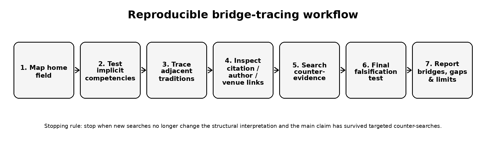
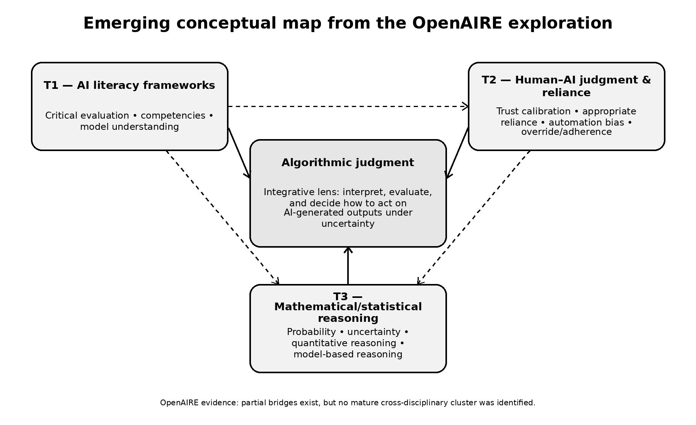

# From Mathematical Reasoning to Algorithmic Judgment
## Tracing a Missing Bridge in AI Literacy Research with the OpenAIRE Graph

**Author:** Eleni Nolka  
**Affiliation:** Department of Informatics and Telematics, Harokopio University of Athens  
**Hackathon:** OpenAIRE AI Hackathon 2026 - Theme A: Explore & Narrate  
**Licence:** CC BY 4.0

## What this project does

This non-code case study uses the Alien Intelligence MCP connector and the OpenAIRE Graph to trace how three research traditions relate to one another:

1. **AI literacy and competency frameworks** - critical evaluation, AI competencies, model understanding.
2. **Human-AI judgment and reliance** - trust calibration, appropriate reliance, automation bias, algorithm aversion, adherence and override.
3. **Mathematical/statistical reasoning** - probability, uncertainty, quantitative reasoning and model-based reasoning.

The exploration began with a broad question about reasoning in AI literacy and progressively followed adjacent disciplinary vocabularies. A final falsification stage actively searched for evidence that a mature bridge already connects the three traditions.

## Main finding

Within the OpenAIRE-indexed evidence examined, **partial bridges exist, but no mature cross-disciplinary cluster was identified that integrates all three traditions**. AI literacy frameworks already include critical evaluation; HCI and psychology contain mature empirical paradigms for appropriate reliance and trust calibration; mathematics/statistics education contains mature traditions for reasoning under uncertainty. The missing connection is not the absence of these ingredients, but their weak integration.

The project therefore uses **algorithmic judgment** as an *integrative lens*, not as an established literature construct:

> the capacity to interpret, evaluate, and decide how to act on AI-generated outputs, particularly under conditions of uncertainty.

## Reusable output: Bridge-Tracing Protocol

The method is designed for reuse with other emerging interdisciplinary constructs:

1. Map the home field neutrally.
2. Identify implicit or underspecified competencies.
3. Trace adjacent disciplinary traditions where those competencies are operationalised.
4. Inspect citation, author, venue, project and conceptual links.
5. Distinguish genuine integration from incidental keyword co-occurrence.
6. Search explicitly for counter-evidence.
7. Run a final falsification test.
8. Report integration, partial bridges, fragmentation and limitations separately.

## Conceptual map

## Repository structure

- `README.md` - project overview and reuse instructions.
- `PROMPT_LOG.md` - exact five investigation prompts and decision logic.
- `EVIDENCE_TRAIL.md` - condensed evidence trail and approximate record counts returned by the MCP workflow.
- `METHOD.md` - reusable bridge-tracing protocol and stopping/falsification rules.
- `CASE_STUDY.pdf` / `CASE_STUDY.docx` - narrative case study.
- `figures/` - conceptual map and workflow figure.
- `logs/` - raw Alien/OpenAIRE investigation outputs supplied during the hackathon.
- `LICENSE.md` - CC BY 4.0 statement.

## Reproducibility notes

No code is required. To repeat the exploration, a researcher needs access to the Alien/OpenAIRE MCP environment (or equivalent OpenAIRE Graph API access), the prompts in `PROMPT_LOG.md`, and the decision rules in `METHOD.md`.

Record counts and bibliometric indicators are **time-dependent**. They are reported as returned by the Alien/OpenAIRE workflow during the August 2026 exploration and may change on rerun. Long multi-term AND queries can collapse to very few results, while broad queries can produce false abundance through incidental co-occurrence. The workflow therefore requires inspection of representative records, reformulation of queries, and counter-searches before drawing a conclusion.

## Responsible interpretation

This is an exploratory Open Science case study, **not a systematic review or exhaustive bibliometric analysis**. The strongest claim is therefore: *the fragmentation hypothesis was supported within the OpenAIRE-indexed evidence examined*. It is not a universal proof that no bridging literature exists.

## Selected verified references

- Long, D., & Magerko, B. (2020). *What is AI Literacy? Competencies and Design Considerations*. CHI 2020. https://doi.org/10.1145/3313831.3376727
- Ng, D. T. K., Leung, J. K. L., Chu, S. K. W., & Qiao, M. S. (2021). *Conceptualizing AI literacy: An exploratory review*. Computers and Education: Artificial Intelligence, 2, 100041. https://doi.org/10.1016/j.caeai.2021.100041
- Chiu, T. K. F., Ahmad, Z., Ismailov, M., & Sanusi, I. T. (2024). *What are artificial intelligence literacy and competency? A comprehensive framework to support them*. Computers and Education Open, 6, 100171. https://doi.org/10.1016/j.caeo.2024.100171
- Zhang, Y., Liao, Q. V., & Bellamy, R. K. E. (2020). *Effect of Confidence and Explanation on Accuracy and Trust Calibration in AI-Assisted Decision Making*. FAccT 2020. https://doi.org/10.1145/3351095.3372852
- Laupichler, M. C., Knoth, N., Schleiss, J., & Raupach, T. (2025). *Algorithm aversion revisited: The role of AI literacy and attitudes towards AI in shaping perceptions of AI-generated texts*. British Journal of Educational Technology. https://doi.org/10.1111/bjet.70035
- Tian, J., & Zhang, R. (2025). *Learners' AI dependence and critical thinking: The psychological mechanism of fatigue and the social buffering role of AI literacy*. Acta Psychologica, 260, 105725. https://doi.org/10.1016/j.actpsy.2025.105725

## AI-use disclosure

The Alien Intelligence MCP connector/agent was the primary AI-mediated interface to the OpenAIRE Graph. ChatGPT (OpenAI) was used to design the exploration sequence, refine prompts, structure the evidence trail, compare outputs, identify confirmation-bias risks, and draft/revise the public documentation. Claims in the case study are grounded in the Alien/OpenAIRE outputs retained in `logs/`.

## Licence

Written materials and original figures in this repository are released under **Creative Commons Attribution 4.0 International (CC BY 4.0)**. Third-party bibliographic metadata remain subject to their source terms.
